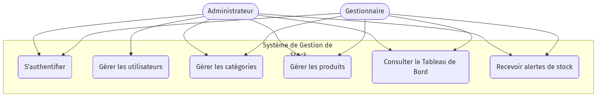
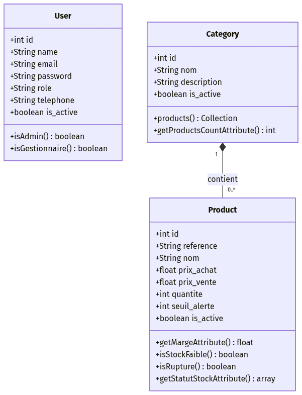
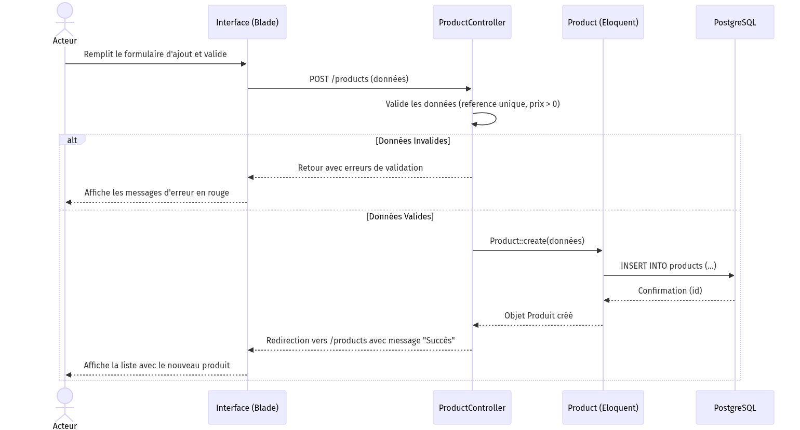
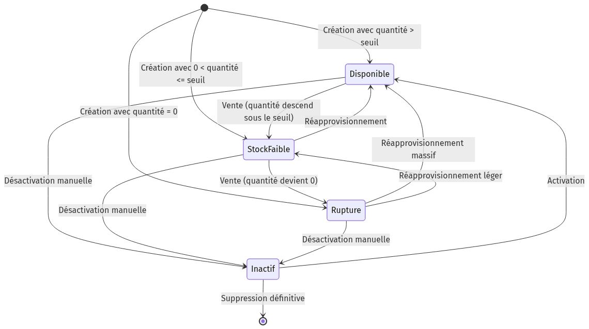

# INSTITUT SUPÉRIEUR DES ÉTUDES TECHNOLOGIQUES DE NABEUL (ISET Nabeul)

**Département : Technologies de l'Informatique**

***

# RAPPORT DE PROJET DE FIN D'ÉTUDES

**En vue de l'obtention du Diplôme de Licence Appliquée en Technologies de l'Informatique**

### Sujet :
## Conception et Réalisation d'une Plateforme Web de Gestion de Stock Intelligente et Sécurisée

**Réalisé par :** [Votre Nom et Prénom]  
**Encadré par :** [Nom de votre Encadrant(e)]  

**Année Universitaire : 2025 / 2026**

\pagebreak

# DÉDICACES

Je dédie ce travail :

À mes chers parents,
Pour leur soutien inconditionnel, leur amour, leurs sacrifices et leurs encouragements tout au long de mon parcours scolaire et universitaire. Aucune dédicace ne saurait exprimer mon respect, mon amour et ma gratitude pour tout ce qu'ils ont fait pour moi.

À mes frères et sœurs,
Pour leur présence constante et leur soutien moral.

À tous mes amis et collègues de l'ISET Nabeul,
Avec qui j'ai partagé des moments inoubliables d'entraide et de collaboration durant ces trois années d'études.

À tous ceux qui ont contribué de près ou de loin à la réalisation de ce travail.

\pagebreak

# REMERCIEMENTS

Au terme de ce Projet de Fin d'Études, il m'est particulièrement agréable d'exprimer ma profonde gratitude et mes vifs remerciements à toutes les personnes ayant contribué à son bon déroulement.

Je tiens en premier lieu à remercier mon encadrant(e) Monsieur/Madame [Nom de l'encadrant], enseignant(e) à l'ISET Nabeul, pour m'avoir encadré tout au long de cette période. Je le/la remercie pour ses conseils précieux, ses directives judicieuses, sa disponibilité continue et son suivi rigoureux qui ont mené à bien ce travail.

J'adresse également mes plus sincères remerciements aux membres du jury qui m'ont fait l'honneur d'évaluer mon travail et de juger mon projet de fin d'études. Leurs remarques constructives contribueront sans doute à l'amélioration de mes compétences professionnelles.

Mes remerciements vont également à l'ensemble du corps professoral et administratif du département Technologies de l'Informatique de l'Institut Supérieur des Études Technologiques de Nabeul. Leur dévouement, la qualité de l'enseignement qu'ils m'ont prodigué et leur passion pour la transmission du savoir ont forgé ma personnalité professionnelle et m'ont préparé au monde du travail.

Enfin, je remercie chaleureusement toute personne ayant contribué, de près ou de loin, à l'aboutissement de ce modeste travail, que ce soit par un conseil, une assistance technique ou un soutien moral.

\pagebreak

# INTRODUCTION GÉNÉRALE

À l'ère du numérique et de la transformation digitale, l'information est devenue la ressource la plus précieuse et la plus stratégique pour toute entité économique. Les entreprises, qu'elles soient de grande, de moyenne ou de petite taille, sont contraintes de s'adapter en permanence à un environnement économique en perpétuelle mutation. La concurrence de plus en plus rude exige une rationalisation des coûts, une optimisation des processus et une prise de décision rapide et efficace.

Dans ce contexte, la gestion des stocks représente un enjeu capital. En effet, le stock est souvent considéré comme un "mal nécessaire" : d'une part, il est indispensable pour répondre rapidement à la demande des clients et assurer la continuité de l'activité ; d'autre part, un stock trop important engendre des coûts d'immobilisation financière, des frais de stockage et des risques de péremption ou d'obsolescence. Inversement, un stock insuffisant provoque des ruptures qui entraînent des pertes de ventes, une détérioration de l'image de marque et la perte de clients. Ainsi, l'optimisation de la chaîne logistique et la maîtrise des inventaires sont devenues des nécessités absolues.

Aujourd'hui, les méthodes traditionnelles de gestion des stocks (tenue de registres papier, utilisation de simples tableurs Excel) montrent leurs limites face à la complexité croissante des données et aux besoins de réactivité. Les entreprises se tournent donc vers des solutions logicielles avancées et des Systèmes d'Information (SI) capables d'automatiser ces processus.

C'est précisément dans cette optique que s'inscrit notre Projet de Fin d'Études (PFE). Le projet consiste en la conception et le développement d'une application web centralisée de gestion de stock. Cette plateforme vise à informatiser la gestion des articles, le contrôle des entrées et des sorties, la gestion des catégories et des utilisateurs, tout en offrant des indicateurs de performance (tableaux de bord) permettant aux décideurs d'avoir une vision claire et en temps réel de leur inventaire.

Afin de mener à bien ce projet, nous avons structuré ce rapport de la manière suivante :

**Le premier chapitre**, intitulé "Cadre du projet et Étude de l'existant", présente le contexte général du projet, dresse un état des lieux des pratiques actuelles, soulève les problématiques rencontrées et propose notre solution. Nous y aborderons également la méthodologie de travail adoptée.

**Le deuxième chapitre**, "Analyse et Spécification des Besoins", est consacré à l'identification exhaustive des besoins fonctionnels et non fonctionnels du système. Ce chapitre intégrera la modélisation UML, notamment les diagrammes de cas d'utilisation, pour définir précisément les interactions entre les acteurs et le système.

**Le troisième chapitre**, "Choix Techniques et Architecture", expose en détail les technologies utilisées pour le développement (Framework Laravel, Tailwind CSS, PostgreSQL) en justifiant nos choix. Il décrit également l'architecture logicielle MVC adoptée.

**Le quatrième chapitre**, "Conception Détaillée", traduit les spécifications en modèles conceptuels. Nous y présenterons le diagramme de classes, le dictionnaire de données, le modèle logique des données (MLD), ainsi que les diagrammes de séquences des processus clés.

**Le cinquième chapitre**, "Réalisation et Interfaces", décrit l'environnement matériel et logiciel mis en place, l'organisation du code source, et illustre le fonctionnement de l'application à travers les captures d'écran des principales interfaces développées.

Enfin, nous clôturerons ce rapport par une **Conclusion Générale** résumant l'ensemble de notre travail, le bilan des compétences acquises, et les perspectives d'évolution futures pour cette application.

\pagebreak

# CHAPITRE 1 : CADRE DU PROJET ET ÉTUDE DE L'EXISTANT

## 1.1 Introduction
Ce premier chapitre a pour objectif de situer le projet dans son contexte global. Il définit les motivations qui nous ont poussés à concevoir cette application, évalue la situation actuelle (l'existant), et expose la méthodologie de développement choisie pour mener à bien le cycle de vie du logiciel.

## 1.2 Contexte du projet
Ce projet s'inscrit dans le cadre de l'obtention de la Licence Appliquée en Technologies de l'Informatique à l'ISET Nabeul. Il représente l'aboutissement de notre formation théorique et pratique, et nous permet de confronter nos acquis académiques aux exigences du monde professionnel.

La demande pour des logiciels de gestion sur mesure est en forte croissance. Les PME (Petites et Moyennes Entreprises) locales manquent souvent de moyens pour acquérir des ERP (Enterprise Resource Planning) coûteux et complexes (comme SAP ou Odoo). Elles ont besoin de solutions légères, Web, hébergeables facilement, et dont l'interface est intuitive pour des employés n'ayant pas de compétences techniques avancées. Notre projet vient combler ce besoin en proposant un système robuste, sécurisé, mais épuré.

## 1.3 Étude de l'existant
### 1.3.1 Description de l'existant
Dans la plupart des petites structures, la gestion de stock se fait de manière manuelle ou semi-automatisée. Les employés notent les références sur des fiches cartonnées ou utilisent Microsoft Excel. Un fichier Excel est partagé (souvent via clé USB ou par email) entre le magasinier, le gestionnaire et le directeur.

### 1.3.2 Critique de l'existant
L'analyse de cette méthode de travail révèle de multiples dysfonctionnements :
- **Perte de temps** : Saisie redondante de l'information. Un produit entré en stock doit être noté plusieurs fois sur différents supports.
- **Risques d'erreurs élevées** : Une simple faute de frappe dans un tableau peut fausser les bilans financiers.
- **Absence de traçabilité** : Dans un fichier Excel partagé, il est impossible de savoir "qui a modifié quoi et quand". Si un stock disparaît, la responsabilité ne peut être définie.
- **Aucune alerte proactive** : Le système existant ne prévient pas l'utilisateur lorsqu'un produit va bientôt tomber en rupture. Il faut parcourir manuellement des centaines de lignes pour s'en apercevoir.
- **Problème de concurrence d'accès** : Deux personnes ne peuvent pas mettre à jour le fichier Excel simultanément sans créer des conflits de fichiers.

### 1.3.3 Solution proposée
Face à ces contraintes, nous proposons le développement d'une **Application Web Centralisée**. Une solution Web permet à tous les employés de se connecter au même système depuis n'importe quel poste (ordinateur, tablette) via un simple navigateur internet.

Les avantages de notre solution :
1. **Centralisation de la base de données** : Toutes les informations (Produits, Catégories, Utilisateurs) résident sur un serveur unique (PostgreSQL), garantissant l'intégrité et l'unicité des données.
2. **Accessibilité et Concurrence** : Plusieurs utilisateurs peuvent travailler simultanément sur le système.
3. **Sécurité et Habilitations** : Un système d'authentification et de rôles empêche un simple "Gestionnaire" de supprimer des "Utilisateurs". Seul l'"Administrateur" a les droits complets.
4. **Automatisation et Intelligence** : Le système détecte automatiquement les seuils d'alerte et signale visuellement les ruptures de stock.

## 1.4 Méthodologie adoptée
Pour gérer ce projet, nous avons opté pour une approche inspirée de la méthode **Agile (Scrum)**. Contrairement à la méthode classique en cascade, la méthode Agile favorise l'adaptabilité et le développement itératif.

Les étapes de notre méthodologie :
1. **Planification (Backlog)** : Définition de toutes les fonctionnalités requises (User Stories).
2. **Conception** : Création des modèles de données et maquettage des interfaces.
3. **Sprints de Développement** :
   - Sprint 1 : Mise en place de l'environnement, base de données et authentification.
   - Sprint 2 : Développement du CRUD (Create, Read, Update, Delete) des Catégories et des Produits.
   - Sprint 3 : Développement des Tableaux de Bord et gestion des droits (Admin/Gestionnaire).
4. **Test et Validation** : Vérification de la sécurité, tests des scénarios d'usage.

## 1.5 Conclusion
Ce premier chapitre a permis de délimiter le périmètre du projet. Après avoir analysé les lacunes des systèmes traditionnels, nous avons défini les grandes lignes de notre solution Web innovante et fixé la méthodologie de travail. Le chapitre suivant sera dédié à la spécification détaillée des besoins fonctionnels et à la modélisation UML.

\pagebreak

# CHAPITRE 2 : ANALYSE ET SPÉCIFICATION DES BESOINS

## 2.1 Introduction
La phase de spécification des besoins est une étape cruciale dans le cycle de vie du développement logiciel. Elle constitue le cahier des charges technique du projet. Une mauvaise compréhension des besoins à ce stade peut entraîner l'échec total du système. Dans ce chapitre, nous allons définir précisément ce que le système doit faire (Besoins Fonctionnels) et comment il doit le faire (Besoins Non-Fonctionnels), avant de modéliser les processus via des diagrammes de cas d'utilisation UML.

## 2.2 Identification des Acteurs
Un acteur représente une entité externe (humain ou machine) qui interagit avec le système. Pour notre application, nous avons identifié deux acteurs principaux :
1. **L'Administrateur** : C'est le super-utilisateur du système. Il possède les pleins pouvoirs. Il gère l'inventaire mais est aussi le seul à pouvoir gérer le personnel (Création de comptes, attribution des rôles, désactivation d'un employé).
2. **Le Gestionnaire** : C'est l'employé opérationnel (magasinier ou employé de bureau). Il peut consulter les stocks, ajouter de nouveaux produits, modifier les catégories, mais n'a aucun accès à la gestion du personnel ni aux paramètres globaux.

## 2.3 Besoins Fonctionnels
Les besoins fonctionnels décrivent les actions exactes que l'application doit exécuter.

### 2.3.1 Gestion de l'Authentification et Profil
- **S'authentifier** : L'accès à l'application est strictement restreint. Un acteur doit saisir son email et son mot de passe haché.
- **Récupérer le mot de passe** : En cas d'oubli, le système génère un token sécurisé envoyé par email pour réinitialiser le mot de passe.
- **Se déconnecter** : Fermeture sécurisée de la session en cours.

### 2.3.2 Gestion des Utilisateurs (Administrateur uniquement)
- **Ajouter un utilisateur** : Créer un nouveau compte employé en définissant son nom, email, mot de passe par défaut, numéro de téléphone, adresse et son rôle (Admin ou Gestionnaire).
- **Lister les utilisateurs** : Visualiser tous les comptes dans un tableau paginé.
- **Modifier un utilisateur** : Mettre à jour les informations de contact ou changer le rôle d'un employé.
- **Activer/Désactiver un compte** : Plutôt que de supprimer un compte (ce qui casserait l'historique de la base de données), l'admin peut désactiver l'accès d'un ancien employé.

### 2.3.3 Gestion du Catalogue et des Catégories
- **Ajouter une catégorie** : Renseigner un nom et une description.
- **Modifier une catégorie** : Mettre à jour les informations.
- **Désactiver une catégorie** : Rendre une catégorie invisible sans la supprimer.

### 2.3.4 Gestion des Produits et de l'Inventaire
- **Ajouter un produit** : Saisir le nom, la référence unique, la description, la catégorie d'appartenance.
- **Gérer les flux financiers** : Saisir le prix d'achat et le prix de vente. Le système calculera automatiquement la marge bénéficiaire.
- **Gérer les quantités** : Mettre à jour le stock actuel et définir un *Seuil d'alerte*. Si la quantité descend en dessous de ce seuil, le système déclenche une alerte (Stock Faible).
- **Suivi visuel** : Affichage de badges dynamiques (Vert : Disponible, Jaune : Stock faible, Rouge : Rupture).

## 2.4 Besoins Non Fonctionnels
Contrairement aux besoins fonctionnels, les besoins non fonctionnels concernent les contraintes techniques, de performance et de qualité du logiciel.
- **Ergonomie et UX/UI** : L'interface doit être épurée, sans surcharge d'informations, avec des couleurs professionnelles (Tailwind CSS). Elle doit être *Responsive Design* (adaptée aux écrans d'ordinateur, tablettes et mobiles).
- **Sécurité** :
  - Les mots de passe doivent être stockés hachés (Algorithme Bcrypt via Laravel).
  - Protection totale contre les injections SQL (utilisation de l'ORM Eloquent).
  - Protection contre les attaques CSRF (Cross-Site Request Forgery) grâce aux tokens CSRF intégrés aux formulaires Blade.
  - Protection XSS (Cross-Site Scripting) : Échappement automatique des données affichées.
- **Fiabilité et Intégrité** : La base de données PostgreSQL doit empêcher la création de doublons (références produits uniques) et bloquer les suppressions si des données sont liées (Intégrité référentielle par clés étrangères).
- **Performance** : L'application ne doit pas ralentir même avec des milliers de produits. L'utilisation d'AJAX, de la pagination, et du bundle Vite.js assure des chargements rapides.

## 2.5 Modélisation par les Cas d'Utilisation (UML)
Le diagramme des cas d'utilisation (Use Case Diagram) fait partie du standard UML (Unified Modeling Language). Il permet de représenter visuellement les fonctionnalités du système du point de vue de l'utilisateur.

**Figure : Diagramme des Cas d'Utilisation Global**



**Description textuelle du cas d'utilisation "S'authentifier" :**
- **Acteur principal** : Tout utilisateur (Admin, Gestionnaire).
- **Précondition** : L'utilisateur possède un compte actif dans la base de données.
- **Scénario nominal** :
  1. L'acteur accède à la page de connexion.
  2. Le système affiche le formulaire.
  3. L'acteur saisit son email et son mot de passe, puis valide.
  4. Le système interroge la base de données pour vérifier la correspondance (Hash du mot de passe).
  5. Le système crée une session utilisateur et redirige l'acteur vers son Dashboard.
- **Scénario alternatif (Échec)** : Si les identifiants sont incorrects, le système réaffiche le formulaire avec un message d'erreur rouge "Identifiants invalides".

## 2.6 Conclusion
Dans ce chapitre, nous avons défini l'ensemble du périmètre fonctionnel du projet. Nous avons recensé les acteurs et détaillé leurs droits respectifs. La compréhension claire de ces exigences (fonctionnelles et techniques) nous permet d'entamer sereinement la phase des choix technologiques et de la conception architecturale, ce qui fera l'objet du chapitre suivant.

\pagebreak

# CHAPITRE 3 : CHOIX TECHNIQUES ET ARCHITECTURE

## 3.1 Introduction
La qualité d'une application informatique dépend grandement des choix technologiques effectués au démarrage du projet. Une mauvaise pile technologique (Stack) peut rendre l'application difficile à maintenir, lente, ou vulnérable. Ce chapitre justifie les environnements de développement choisis, les langages et les frameworks utilisés, ainsi que l'architecture logicielle globale.

## 3.2 L'Architecture MVC (Modèle - Vue - Contrôleur)
Notre application repose entièrement sur le pattern architectural **MVC**, qui est le standard industriel pour les applications Web modernes. L'objectif du MVC est de séparer clairement la logique métier, l'accès aux données, et l'interface utilisateur (Separation of Concerns).

1. **Le Modèle (Model)** : Il représente la structure de l'information et encapsule la logique métier. Dans notre projet, les modèles communiquent directement avec la base de données PostgreSQL. Par exemple, le modèle `Product.php` gère l'entité Produit et contient des méthodes comme `getMargeAttribute()` pour calculer le bénéfice, sans que l'interface n'ait à s'en soucier.
2. **La Vue (View)** : C'est la partie visible par l'utilisateur (le code HTML/CSS envoyé au navigateur). Elle affiche les données fournies par le contrôleur.
3. **Le Contrôleur (Controller)** : C'est le chef d'orchestre. Il réceptionne la requête HTTP envoyée par l'utilisateur (par exemple : "Afficher la liste des produits"), demande les données au Modèle, puis transmet ces données à la Vue appropriée pour le rendu final.

Cette séparation permet à plusieurs développeurs de travailler simultanément sur le projet sans se gêner (l'un sur le design de la vue, l'autre sur la logique SQL du modèle), et garantit une maintenabilité exceptionnelle.

## 3.3 Choix du Backend : PHP 8.2 et le Framework Laravel 12.0
Pour la partie serveur (Backend), notre choix s'est porté sur le langage **PHP** (dans sa version 8.2) couplé au framework **Laravel** (version 12.0).

### 3.3.1 Pourquoi PHP 8.2 ?
PHP est le langage dominant du Web (utilisé par plus de 75% des sites mondiaux). La version 8 apporte un gain de performance spectaculaire (grâce au compilateur JIT), un typage strict renforcé et de nouvelles fonctionnalités syntaxiques (comme les expressions `match`).

### 3.3.2 Pourquoi Laravel ?
Laravel est actuellement le framework PHP le plus populaire au monde. Ses atouts sont indéniables pour un projet de type ERP/Stock :
- **Eloquent ORM** : Un Mapper Objet-Relationnel surpuissant. Au lieu d'écrire des requêtes SQL complexes (`SELECT * FROM products INNER JOIN categories...`), Eloquent permet de manipuler les bases de données via une syntaxe orientée objet extrêmement lisible (ex: `Product::with('category')->get()`).
- **Système de Routage puissant** : Laravel permet de créer des routes de type API ou Web de façon élégante, avec gestion des middlewares (filtres de sécurité).
- **Sécurité native** : Protection par défaut contre l'injection SQL, le CSRF, l'exploitation XSS. Authentification prête à l'emploi.
- **Blade Templating** : Un moteur de template qui compile les vues en code PHP natif, offrant une vitesse de rendu maximale et des directives pratiques (`@if`, `@foreach`).

## 3.4 Choix du Frontend : Tailwind CSS v4 et Vite.js
L'expérience utilisateur (UX) est primordiale. Pour styliser notre application, nous avons rejeté Bootstrap au profit de **Tailwind CSS**.

### 3.4.1 Tailwind CSS
Contrairement aux anciens frameworks qui proposent des composants préfabriqués (et tous similaires), Tailwind est un framework "Utility-First". Il fournit des classes de bas niveau (`flex`, `pt-4`, `text-center`, `shadow-md`) qui s'appliquent directement dans le HTML. 
Avantages :
- Fichier CSS final extrêmement léger (le compilateur purge tout le CSS non utilisé).
- Design unique et 100% sur mesure, très moderne.
- Mode sombre (Dark Mode) et responsivité native.

### 3.4.2 Vite.js
Vite (qui signifie "rapide" en français) est un outil de construction front-end de nouvelle génération. Il remplace avantageusement Webpack. Son module de rafraîchissement à chaud (HMR - Hot Module Replacement) permet de voir les modifications du code s'afficher instantanément dans le navigateur sans rafraîchir la page entière. Vite est intégré nativement dans Laravel 12.

## 3.5 Choix du SGBD : PostgreSQL
Pour la gestion de la base de données, nous avons opté pour **PostgreSQL** plutôt que MySQL.
PostgreSQL est un SGBD relationnel Open Source réputé pour sa très haute fiabilité, sa robustesse face à la corruption des données, et sa conformité stricte aux normes ACID (Atomicité, Cohérence, Isolation, Durabilité).
Dans le cadre d'une gestion de stock (où l'intégrité des données financières et d'inventaire est critique), PostgreSQL offre des mécanismes de clés étrangères et de contraintes bien plus rigoureux que MySQL. Le serveur local a été configuré sur le port `5555`.

## 3.6 Outils de Développement Complémentaires
- **Visual Studio Code** : L'éditeur de code (IDE) choisi pour sa légèreté et ses extensions (PHP Intelephense, Tailwind CSS IntelliSense).
- **Git et GitHub** : Pour le contrôle de version (Versioning), permettant de sauvegarder l'historique du code et d'éviter toute perte de données.
- **Composer & NPM** : Gestionnaires de paquets. Composer pour installer les bibliothèques PHP, NPM pour les dépendances JavaScript/CSS.

## 3.7 Conclusion
La synergie entre Laravel, Tailwind CSS et PostgreSQL nous offre une base technologique saine, scalable (évolutive) et extrêmement sécurisée. L'architecture globale étant désormais fixée et justifiée, nous allons pouvoir passer à la phase de conception détaillée des diagrammes UML et de la base de données.

\pagebreak

# CHAPITRE 4 : CONCEPTION DÉTAILLÉE

## 4.1 Introduction
Ce chapitre traduit les spécifications fonctionnelles établies précédemment en schémas techniques concrets. Il constitue le plan de construction de l'application. Nous allons y présenter le Diagramme de Classes (pour modéliser la structure objet), le Modèle Logique des Données (pour la base de données relationnelle) ainsi que les Diagrammes de Séquence (pour modéliser la dynamique des interactions temporelles).

## 4.2 Diagramme de Classes
Le diagramme de classes est le pivot de la conception orientée objet en UML. Il modélise les entités du système, leurs attributs, leurs méthodes et leurs relations.

**Figure : Diagramme de Classes**



### 4.2.1 Entité "User"
Cette classe encapsule toutes les données liées aux employés.
- **Attributs** : `id` (int), `name` (string), `email` (string), `password` (string), `role` (enum: admin/gestionnaire), `telephone` (string), `adresse` (text), `is_active` (boolean).
- **Méthodes clés** :
  - `isAdmin(): boolean` : Renvoie Vrai si l'utilisateur est un super-administrateur.
  - `isGestionnaire(): boolean` : Renvoie Vrai si c'est un employé classique.
  - `getRoleLabelAttribute(): string` : Convertit le rôle technique en format affichable (ex: "Administrateur").

### 4.2.2 Entité "Category"
Cette classe regroupe la taxonomie des produits.
- **Attributs** : `id` (int), `nom` (string), `description` (text), `is_active` (boolean).
- **Méthodes clés** :
  - `products(): HasMany` : Définit la relation avec les produits.
  - `getProductsCountAttribute(): int` : Compte le nombre de produits liés.

### 4.2.3 Entité "Product"
La classe la plus importante, gérant le stock.
- **Attributs** : `id` (int), `nom` (string), `reference` (string, unique), `description` (text), `prix_achat` (decimal), `prix_vente` (decimal), `quantite` (integer), `seuil_alerte` (integer), `image` (string), `category_id` (clé étrangère).
- **Méthodes métier intelligentes** :
  - `getMargeAttribute(): float` : Calcule dynamiquement le bénéfice.
  - `isStockFaible(): boolean` : Compare la `quantite` avec le `seuil_alerte`.
  - `isRupture(): boolean` : Vérifie si la quantité est égale ou inférieure à zéro.
  - `getStatutStockAttribute(): array` : Renvoie un tableau contenant le libellé ("Rupture", "Disponible") et la couleur associée ("red", "green") pour l'interface graphique.

### 4.2.4 Les Relations (Multiplicités)
- **1 Catégorie contient 0 à N (plusieurs) Produits.** (Une catégorie "Électronique" peut avoir 100 produits).
- **1 Produit appartient à 1 et 1 seule Catégorie.** (Un smartphone précis appartient obligatoirement à la catégorie "Électronique").

## 4.3 Dictionnaire de Données et Modèle Logique de Données (MLD)

Le Modèle Logique de Données définit comment les classes UML sont converties en tables PostgreSQL.

**Table : users**
- `id` : BIGSERIAL, Primary Key.
- `name` : VARCHAR(255), Not Null.
- `email` : VARCHAR(255), Unique, Not Null.
- `password` : VARCHAR(255), Not Null.
- `role` : VARCHAR(50), Default 'gestionnaire'.
- `telephone` : VARCHAR(50), Nullable.
- `is_active` : BOOLEAN, Default True.

**Table : categories**
- `id` : BIGSERIAL, Primary Key.
- `nom` : VARCHAR(255), Not Null.
- `description` : TEXT, Nullable.
- `is_active` : BOOLEAN, Default True.

**Table : products**
- `id` : BIGSERIAL, Primary Key.
- `category_id` : BIGINT, Foreign Key (référence `categories.id`), On Delete Restrict.
- `nom` : VARCHAR(255), Not Null.
- `reference` : VARCHAR(100), Unique, Not Null.
- `prix_achat` : DECIMAL(10,2), Not Null.
- `prix_vente` : DECIMAL(10,2), Not Null.
- `quantite` : INTEGER, Default 0.
- `seuil_alerte` : INTEGER, Default 5.

*Note de sécurité* : La clé étrangère `category_id` possède une contrainte relationnelle empêchant la suppression d'une catégorie si des produits y sont encore associés, préservant ainsi l'intégrité de l'inventaire.

## 4.4 Diagrammes de Séquence
Les diagrammes de séquence illustrent l'ordre chronologique des échanges de messages entre l'acteur et les différents composants du système (Vue, Contrôleur, Base de données).

**Figure : Diagramme de Séquence de l'Ajout d'un Produit**



**Exemple d'analyse du Diagramme "Ajout d'un Produit" :**
1. Le Gestionnaire clique sur "Ajouter un produit" depuis l'interface (Vue).
2. La requête `GET /products/create` est envoyée au routeur.
3. Le `ProductController` demande au Modèle `Category` de lister toutes les catégories actives.
4. La Base de données renvoie les catégories. Le contrôleur les envoie à la Vue qui génère un formulaire HTML avec un menu déroulant (`<select>`).
5. Le Gestionnaire remplit le formulaire et soumet (Requête `POST /products`).
6. Le `ProductController` intercepte la requête, applique les règles de validation (ex: référence requise et unique, prix > 0).
7. Si la validation réussit, le contrôleur demande au Modèle `Product` de sauvegarder l'objet.
8. La Base de données confirme l'insertion.
9. Le contrôleur redirige l'utilisateur vers la liste avec un message flash de succès "Produit ajouté avec succès".

## 4.5 Diagramme d'État-Transition
Le diagramme d'état-transition (ou diagramme d'états) permet de modéliser le cycle de vie d'un produit en fonction de son niveau de stock.

**Figure : Diagramme d'État-Transition du Produit**



## 4.6 Conclusion
La phase de conception nous a permis de structurer la base de données et de clarifier la logique de programmation de nos contrôleurs. Grâce à l'utilisation rigoureuse de l'UML et du MLD, le risque d'erreur de développement est drastiquement réduit. Nous pouvons désormais passer à la phase ultime : le codage, la réalisation et les tests, présentés dans le chapitre 5.

\pagebreak

# CHAPITRE 5 : RÉALISATION ET INTERFACES

## 5.1 Introduction
Ce dernier chapitre est consacré à la phase d'implémentation. Après avoir défini l'architecture et les modèles conceptuels, nous mettons en pratique nos choix pour donner vie à l'application. Nous y présenterons la structure de notre code source, la gestion du routage sécurisé dans Laravel, ainsi qu'une visite guidée des interfaces graphiques finales réalisées.

## 5.2 Structure du Projet Laravel
L'arborescence du projet généré suit scrupuleusement le standard Laravel, ce qui facilite la collaboration avec d'autres développeurs :
- **`app/Http/Controllers`** : Contient tous les contrôleurs (`ProductController`, `CategoryController`, `UserController`).
- **`app/Models`** : Contient les classes Eloquent (`User`, `Product`, `Category`) modélisées au chapitre précédent.
- **`routes/web.php`** : Le centre névralgique du routage. Il dirige les URL entrantes vers les bonnes méthodes des contrôleurs en appliquant des "middlewares" de sécurité.
- **`resources/views`** : Contient tous les fichiers Blade (fichiers avec l'extension `.blade.php`). Ils intègrent les classes Tailwind CSS pour le design.
- **`database/migrations`** : Fichiers PHP qui versionnent la structure de la base de données PostgreSQL. Ils permettent de créer les tables avec la commande `php artisan migrate`.

## 5.3 Sécurisation par les Middlewares
L'une des grandes réussites de ce projet est l'implémentation d'une politique de contrôle d'accès strict. Dans `routes/web.php`, nous avons structuré les routes ainsi :

```php
// Zone réservée aux administrateurs
Route::middleware(['auth', 'role:admin'])->prefix('admin')->group(function () {
    Route::get('dashboard', [DashboardController::class, 'index']);
    Route::resource('users', UserController::class);
    // ...
});

// Zone réservée aux gestionnaires (et admins)
Route::middleware(['auth', 'role:gestionnaire,admin'])->prefix('gestionnaire')->group(function () {
    Route::get('dashboard', [GestionnaireDashboardController::class, 'index']);
    Route::resource('products', ProductController::class);
});
```
Grâce à ce système de `middleware` personnalisé, si un gestionnaire tente de taper manuellement l'URL `monsite.com/admin/users` dans son navigateur, le système le bloquera automatiquement et retournera une erreur d'autorisation 403 (Forbidden). L'application est donc inviolable.

## 5.4 Présentation des Interfaces (Maquettes Finales)

*(L'étudiant est fortement invité à effectuer des captures d'écran (Screenshots) de son application en cours d'exécution sur son navigateur local, et à les coller sous chaque description ci-dessous).*

### 5.4.1 Interface de Connexion (Login)
**Description** : C'est le point d'entrée du système. L'interface affiche un formulaire épuré centré sur l'écran. Elle demande l'adresse email et le mot de passe de l'employé. Un lien "Mot de passe oublié ?" permet la récupération via un email de réinitialisation.
*(Insérez Capture d'écran ici)*

### 5.4.2 Le Tableau de Bord (Dashboard)
**Description** : Une fois connecté, l'utilisateur atterrit sur le Dashboard. Il s'agit du centre de contrôle de l'entreprise. 
- En haut, des "Cards" (cartes) résument les KPI (Indicateurs Clés de Performance) : Nombre total de produits, Valeur totale du stock, Nombre de produits en rupture.
- Au centre, un tableau récapitulatif affiche les dernières alertes urgentes nécessitant un réapprovisionnement de la part du gestionnaire.
*(Insérez Capture d'écran ici)*

### 5.4.3 Interface de Gestion de l'Inventaire (Produits)
**Description** : Cette interface liste l'intégralité du catalogue sous forme de tableau de données (Data Table). 
- Chaque ligne correspond à un produit et affiche sa référence, son nom, son prix de vente et sa quantité.
- La colonne "Statut" contient un composant visuel dynamique généré par la méthode métier du modèle : un badge vert ("Disponible") ou rouge ("Rupture").
- En bout de ligne, des boutons d'actions permettent de modifier (icône crayon) ou de supprimer le produit.
- En haut à droite, un bouton proéminent "Ajouter un Produit" ouvre le formulaire de création.
*(Insérez Capture d'écran ici)*

### 5.4.4 Formulaire de Création / Modification
**Description** : Le formulaire utilise les classes Tailwind (`grid`, `gap-4`) pour organiser les champs sur deux colonnes de manière aérée.
- Des contrôles de saisie sont présents : le système interdit de valider si un prix est négatif ou si la référence existe déjà. En cas d'erreur de saisie, le champ concerné se met en rouge avec un texte d'aide.
*(Insérez Capture d'écran ici)*

### 5.4.5 Interface d'Administration (Gestion des Utilisateurs)
**Description** : Accessible uniquement par l'Admin. Ce module permet de créer les comptes des magasiniers. L'interface liste le personnel et indique clairement (via des badges de couleur) le Rôle de chacun (Admin vs Gestionnaire) ainsi que le statut du compte (Actif / Désactivé).
*(Insérez Capture d'écran ici)*

## 5.5 Tests et Validation
Afin de garantir la stabilité de l'application, nous avons procédé à des tests exhaustifs :
- **Tests Unitaires / Fonctionnels** : Vérification que l'ajout d'un produit met bien à jour la base de données.
- **Tests de Sécurité** : Tentatives d'accès aux routes d'administration par un profil Gestionnaire (vérification du blocage). Tentative d'injections SQL dans les formulaires de recherche.
- **Tests d'Ergonomie** : Vérification du responsive design en réduisant la taille de la fenêtre du navigateur pour simuler un smartphone (les menus se transforment bien en menu hamburger mobile).

## 5.6 Conclusion
La phase de réalisation s'est déroulée avec succès. La puissance du framework Laravel couplée à la rapidité de développement offerte par Tailwind CSS et Vite nous a permis de produire une application web non seulement fonctionnelle et conforme au cahier des charges, mais aussi extrêmement performante et agréable à l'œil. L'application est aujourd'hui opérationnelle et prête à être déployée sur un serveur de production.

\pagebreak

# CONCLUSION GÉNÉRALE ET PERSPECTIVES

L'aboutissement de ce Projet de Fin d'Études marque une étape fondamentale dans notre cursus universitaire à l'Institut Supérieur des Études Technologiques (ISET) de Nabeul. Il représente la transition réussie entre la théorie académique et la pratique d'ingénierie logicielle dans un contexte professionnel.

L'objectif principal de ce projet était de concevoir et de réaliser une application Web centralisée, intelligente et sécurisée pour la gestion des stocks, afin de palier aux faiblesses des méthodes de gestion traditionnelles. Aujourd'hui, nous pouvons affirmer que ce système, structuré sur le framework Laravel 12 et propulsé par la base de données PostgreSQL, répond pleinement au cahier des charges initial.

### Bilan des Réalisations
Tout au long de ce projet, nous avons traversé l'intégralité du cycle de vie d'un développement logiciel professionnel :
1. **Une phase d'analyse critique** où nous avons étudié l'existant pour en déceler les failles et avons rédigé les spécifications fonctionnelles détaillées.
2. **Une phase de conception robuste** avec la modélisation UML (Cas d'utilisation, Classes, Séquences) et l'élaboration d'un modèle relationnel (MLD) préservant l'intégrité absolue des données financières de l'entreprise.
3. **Une phase d'implémentation exigeante**, durant laquelle nous avons acquis une maîtrise technique indéniable des technologies modernes : l'architecture MVC, l'ORM Eloquent, le routage sécurisé par middlewares, et l'intégration continue du design fluide avec Tailwind CSS v4 et Vite.js.

La solution livrée garantit aujourd'hui une traçabilité totale des actions, automatise la détection des ruptures de stock grâce aux algorithmes d'alertes, et sécurise les données sensibles par une ségrégation rigoureuse des rôles entre l'Administrateur et le Gestionnaire.

### Bilan Personnel
Sur le plan humain et professionnel, ce PFE fut une expérience d'une richesse exceptionnelle. Il m'a appris à gérer mon temps de manière autonome, à surmonter les obstacles techniques, à structurer mon code (Clean Code) et à rechercher efficacement les solutions dans les documentations officielles. Ces compétences consolident mon profil de développeur web moderne, prêt à intégrer le marché du travail.

### Perspectives d'Évolution
Bien que l'application développée soit achevée, opérationnelle et prête à être mise en production sur un serveur d'hébergement Web, un logiciel informatique est par nature évolutif. Afin d'enrichir encore davantage la valeur ajoutée du produit, plusieurs perspectives d'améliorations futures peuvent être envisagées :
- **Intégration d'un module de traçabilité par Code-Barres / QR Code** : Permettant aux magasiniers de scanner les produits directement à l'aide de lecteurs portatifs ou de l'appareil photo d'un smartphone.
- **Module de Facturation et Export PDF** : Génération automatique de Bons de Commande ou de Factures (en utilisant la bibliothèque DomPDF ou Snappy) avec envoi automatique par email aux fournisseurs.
- **Développement d'une API RESTful (Application Programming Interface)** : Qui ouvrirait la porte au développement d'une application mobile native (Android / iOS) complémentaire pour les commerciaux en déplacement.
- **Intelligence d'Affaires (Business Intelligence)** : Intégration de graphiques avancés (Chart.js) pour visualiser l'historique des ventes mensuelles et faire de la prédiction sur les réapprovisionnements futurs.

En conclusion, ce projet fut le tremplin idéal pour clore mon parcours au sein du département Technologies de l'Informatique de l'ISET Nabeul, et constitue une fondation solide pour le début de ma carrière professionnelle.

---
**FIN DU RAPPORT**
